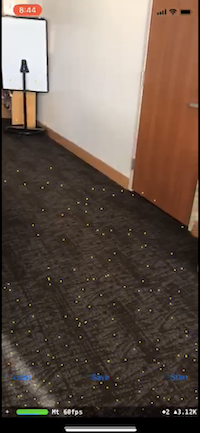

# LociAR
### *Learn on the walk*

## Conception
People think of education simply as the encoding of knowledge, but most people don't realize that the hard part about learning is the **recall**. The focus of this project was to use Augmented Reality to enhance recall by mapping concepts and knowledge onto spatial objects on a path–a popular recalling technique called the *Method of Loci*. This idea, inspired from the Mind Palace technique in the TV show 'Sherlock', helps enhance association of knowledge using paths that we are familiar with - for instance, those we walk as we go through our daily routine.

## Fundamentals
LociAR is an iOS App that helps users improve recall by enabling them to create virtual **"mind palaces"** based on routes they are familiar with. This is done through Augmented Reality - the user can create nodes corresponding to spatial objects on the path they choose to travel by, such as trees, lampposts, etc. Each node can store a title (visible through the camera), and a more detailed description that appears if the node is selected. The user can also store and load different paths, with each corresponding to any particular category.

## Frameworks
LociAR is built on ARKit along with the SceneKit framework to build the iOS App. The programming language used was Swift. SceneKit was used in the creation and detection of nodes. ARKit was used for most augmented reality actions as well as implementing the persistence of AR sessions to ensure a user can save and reload paths to 'revive' a path they've walked on before. 

## Screenshots

   
